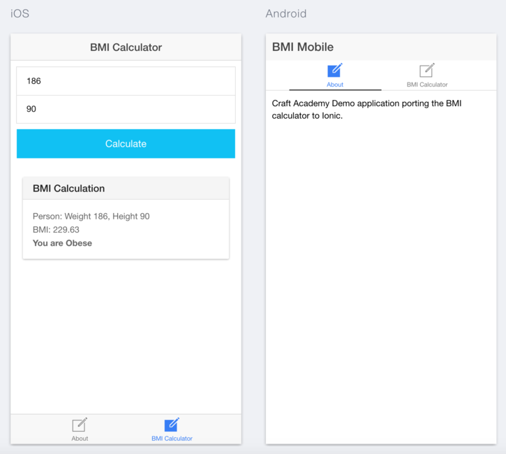

## Adding functionality

Okay, let's move on to implementing the BMI Calculator. 

Copy the `person.js` and `bmi_calculator.js` files into your `www/js` folder. If you don't have the source files, you can find them in the Extras chapter of this walkthrough.

Reference those files in your main template file (`www/index.html`) in the block where you are including your other `js` files.
```html
<!-- www/index.html -->

  <!-- your app's js -->
  <script src="js/app.js"></script>
  <script src="js/controllers.js"></script>
  <script src="js/services.js"></script>
  <script src="js/person.js"></script>
  <script src="js/bmi_calculator.js"></script>
```
 
Let's create a form on the `calculator.html` template that will allow the user to input his/her weight and height and return the calculated values. 
 
 ```html
 <!-- www/templates/calculator/calculator.html -->
 [...]
 <div class="list">
    <label class="item item-input">
      <input type="number" class="item item-input" placeholder="Weight" ng-model="data.weight">
    </label>
    <label class="item item-input">
      <input type="number" class="item item-input" placeholder="Height" ng-model="data.height">
    </label>
    <button class="button button-full button-calm" ng-click="calculateBMI()">Calculate</button>
 </div>

```

When submitted, the form will send the values from the input fields and store it in the controllers `$scope` as `data` and execute the `calculateBMI()` function. Given that there is a function defined. There isn't at the moment, so let's define it. 
 
Head over to the `BmiController` in your `www/js/controllers.js` file. 

We need to add `$scope` to the controller and define the `calculateBMI()` function.

```javascript
// www/js/controllers.js

.controller('BmiController', function($scope) {
  $scope.data = {};
  $scope.calculateBMI = function() {
    var person = new Person({
      weight: $scope.data.weight,
      height: $scope.data.height
    });
    person.calculate_bmi_met();
    $scope.person = person;
  };
});

```

This will make the object `person` accessible in the HTML template for us to show. Lets add the following code to `calculator.html` 

```html
<!-- www/templates/calculator/calculator.html -->
[...]

<div class="card" ng-if="person">
  <div class="item item-divider">
    BMI Calculation
  </div>
  <div class="item item-text-wrap">
    <p>Person: Weight {{person.weight}}, Height {{person.height}}</p>
    <p>BMI: {{person.bmiValue}}</p>
    <p><strong>You are {{person.bmiMessage}}</strong></p>
  </div>
</div>
```
 
Some explanation
1. The `ng-if="person"` makes sure that the div element is only displayed IF the `$scope.person` object defined.
2. The  `{{}}`  brackets are a way to display variables/objects passed in to the template from the controller. 

You can head over to the browser and try it out. Remember that we have set up the **metric** method of calculation the users BMI. There is a method to calculate BMI using the **imperial** method in the `bmi_calculator.js` code. You can easily make the switch or add functionality that allows the user to switch between the two methods. 

That is however outside the scope of this walkthrough. ;-)
The final app should look something like this.


###Wrap up

There are plenty of other little things you can do in order to update the UI and add functionality to this little application. 

One final thing before we call it quits is to publish your app to [Ionic View](http://view.ionic.io/). Head over to our Ionic platform [signup](https://apps.ionic.io/signup) page to get signed up. 
In your project folder, run the following command:

```
$ ionic upload
```

You will be prompted for your `username` and `password` (the one you received when you signed up). Once this is done, your app will be uploaded to the Ionic platform.

Once this is finished, you will receive output like the following:

```
Uploading App...
App Uploaded (xxxxxxx) #that will be your application code
```

Once this message is shown, your app has been uploaded to the Ionic platform and ready to go.

If you want to view your Ionic App on an iOS or Android device you need to install the ‘Ionic View’ app from the App Store/Google Play. Log in with your credentials. Once logged in, you should see your uploaded app

In order to share your Ionic app with your friends share the app number with them and ask them to download the Ionic View app. If they input that number in the Ionic View app they will be given access to your app. 


 
 

