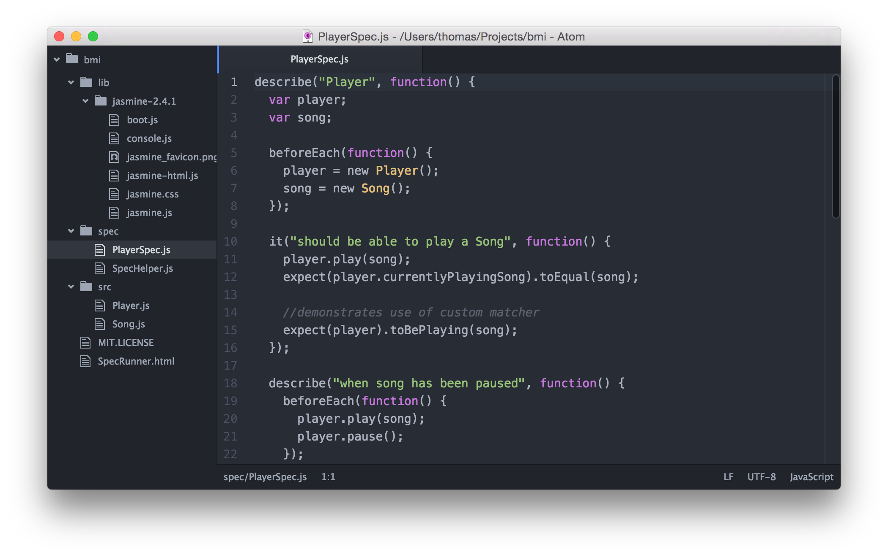

## Testing with Jasmine

Jasmine is a Behaviour Driven Development framework for testing JavaScript code. 

[Download Jasmine runner](https://github.com/jasmine/jasmine/releases)

Create a project folder for the BMI Challenge and extract the content of the `jasmine-standalone.zip` package to that folder.

The package contains some examples of tests. We will not use those tests but we can have a quick look on how testing with Jasmine is set up by browsing the examples.

From your terminal, open the `SpecRunner.html` file:

```shell
$ open SpecRunner.html
```

That will open the test runner in your default browser and you should see something like this. 


Now, let's have a look at the file structure. Open the content of your project folder in your text editor.

```shell
$ atom .
``` 
You should see the basic structure of the example project.


You can leave the files as they are if you want, or you can delete them if you want - we will be deleting them at some point down the road anyway.

The important thing at this moment is to understand how the `SpecRunner.html` works. In order to be able to run the tests and have acces to the source code, these files needs to be included in the runner file. Open it up and locate the following section.

```html
  <!-- include source files here... -->
  <script src="src/Player.js"></script>
  <script src="src/Song.js"></script>

  <!-- include spec files here... -->
  <script src="spec/SpecHelper.js"></script>
  <script src="spec/PlayerSpec.js"></script>

```

As you see, the runner needs to have both the source and the spec files included. Now you can safely remove those lines or comment them out. 

** Remember that whatever files you create (both specs and source files) they MUST be included in the `SpecRunner.html!**

At this point you are set up with the very basic configuration of Jasmine that will allow you to run JavaScript tests.


