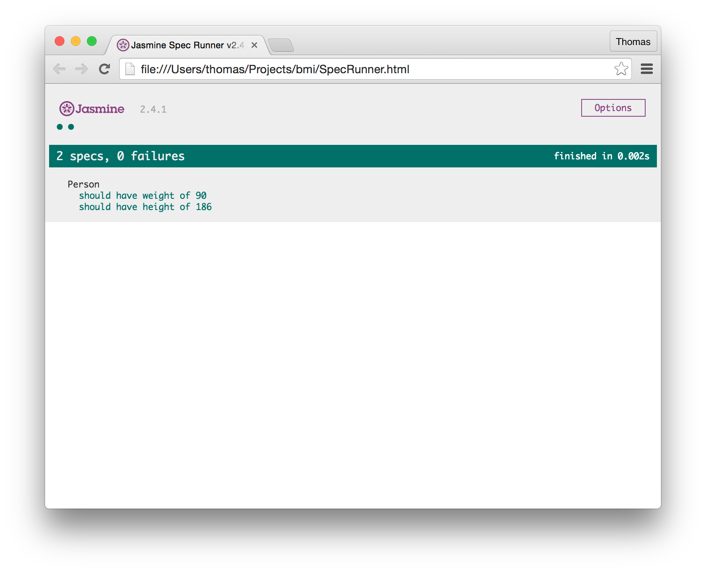
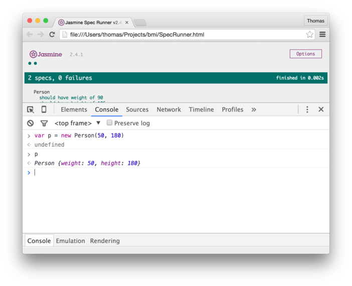

## Firsts tests


Create a new file in your `spec` folder. Call it `person_spec.js`.

```shell
$ touch spec/person_spec.js
```

*** Note that I use the `snake case` format for my file names. You are free to use any format you want but be consistent. ***

We are going to write two test for our Person object. In order to calculate the BMI we will be needing a Person to have two attributes, Weight and Hight.

```js
# spec/person_spec.js

describe("Person", function() {
  var person;

  beforeEach(function() {
    person = new Person(90, 186);
  });

  it("should have weight of 90", function() {
    expect(person.weight).toEqual(90);
  });

  it("should have height of 186", function() {
    expect(person.height).toEqual(186);
  });
});
```

If you reload your `SpecRunner.html` you'll get two errors. 


Let's implement the code that makes this test pass.

In your `src` folder, create a file named `person.js`. Add the following code to that file:

```js
# src/person.js

function Person(weight, height) {
  this.weight = weight;
  this.height = height;
}

```

If you run your tests again, by reloading `SpecRunner.html` you'll see that our two initial tests are passing. 



Okay, the next thing I want you to do is to right clicj anywhare on the browser window and choose `Inspect` from the pop-up menu. That opens the developer console. Try creating a new instance of a `Person` by following the example below.



Cool, the browsers console can function as a way to manually tests your units and functions - similarly to rubys `irb`. 

Let's write some more tests. 
