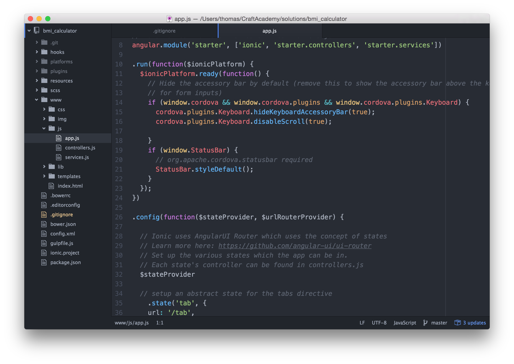
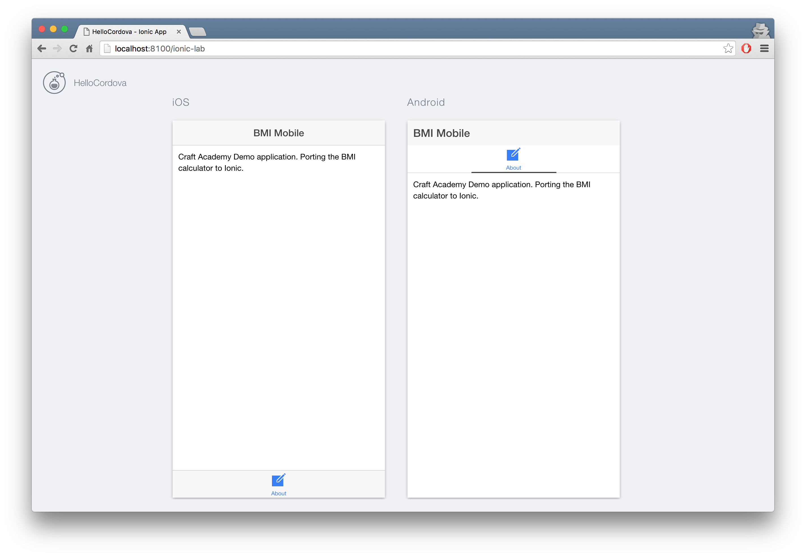

## Cleaning up and adding views
As you could see in the preview, the scaffolded app comes with some initial views, tabs, services and controllers. We will not be using them so we might as well delete those files and clean up the code. 

Open up the application code in your editor. We are using Atom so we will run this command from our project folder:
```
$ atom .
```

The folder I want you to focus on is the `www` folder. That is where we will do most of our work. But let's start with adding the following two lines to your `.gitignore` file. It is located in the project root.

!FILENAME .gitignore
```
.idea/
.DS_Store
```

This ensures that no unnecessary files tracked under version control.

Find `app.js` in the `www/js` folder and locate the following parts:

```javascript:www/js/app.js
  .state('tab.dash', {
    url: '/dash',
    views: {
      'tab-dash': {
        templateUrl: 'templates/tab-dash.html',
        controller: 'DashCtrl'
      }
    }
  })

  .state('tab.chats', {
      url: '/chats',
      views: {
        'tab-chats': {
          templateUrl: 'templates/tab-chats.html',
          controller: 'ChatsCtrl'
        }
      }
    })
  .state('tab.chat-detail', {
    url: '/chats/:chatId',
    views: {
      'tab-chats': {
        templateUrl: 'templates/chat-detail.html',
        controller: 'ChatDetailCtrl'
      }
    }
  })

.state('tab.account', {
  url: '/account',
  views: {
    'tab-account': {
      templateUrl: 'templates/tab-account.html',
      controller: 'AccountCtrl'
    }
  }
});
 ```
 
Delete that entire block of code. Now head over to the `controllers.js` file and delete the following code: 

!FILENAME www/js/controllers.js
```javascript
.controller('DashCtrl', function($scope) {})

.controller('ChatsCtrl', function($scope, Chats) {
  // With the new view caching in Ionic, Controllers are only called
  // when they are recreated or on app start, instead of every page change.
  // To listen for when this page is active (for example, to refresh data),
  // listen for the $ionicView.enter event:
  //
  //$scope.$on('$ionicView.enter', function(e) {
  //});

  $scope.chats = Chats.all();
  $scope.remove = function(chat) {
    Chats.remove(chat);
  };
})

.controller('ChatDetailCtrl', function($scope, $stateParams, Chats) {
  $scope.chat = Chats.get($stateParams.chatId);
})

.controller('AccountCtrl', function($scope) {
  $scope.settings = {
    enableFriends: true
  };
});
```

In the `js` folder, you'll also find the `services.js` file. Open it up and delete the `Chats` factory.

!FILENAME www/js/services.js
```javascript
.factory('Chats', function() {
  // Might use a resource here that returns a JSON array

  // Some fake testing data
  var chats = [{
    id: 0,
    name: 'Ben Sparrow',
    lastText: 'You on your way?',
    face: 'img/ben.png'
  [...]
      }
      return null;
    }
  };
});
```

There is also a `tabs.html` file in the `templates` folder. Open it up and delete the following code:

!FILENAME www/templates/tabs.html
```html
  <!-- Dashboard Tab -->
  <ion-tab title="Status" icon-off="ion-ios-pulse" icon-on="ion-ios-pulse-strong" href="#/tab/dash">
    <ion-nav-view name="tab-dash"></ion-nav-view>
  </ion-tab>

  <!-- Chats Tab -->
  <ion-tab title="Chats" icon-off="ion-ios-chatboxes-outline" icon-on="ion-ios-chatboxes" href="#/tab/chats">
    <ion-nav-view name="tab-chats"></ion-nav-view>
  </ion-tab>

  <!-- Account Tab -->
  <ion-tab title="Account" icon-off="ion-ios-gear-outline" icon-on="ion-ios-gear" href="#/tab/account">
    <ion-nav-view name="tab-account"></ion-nav-view>
  </ion-tab>
```

Also, make sure to delete the following files:
```
www/templates/chat-detail.html
www/templates/tab-account.html
www/templates/tab-chats.html
www/templates/tab-dash.html
```
The only file we want to keep is the `templates/tabs.html` 

Make sure you commit your changes with:

```
$ git add . 
$ git commit -am "clean up scaffolded code"
```

###Adding views

Now that we have cleaned up the code base we are ready to add our own stuff. We'll be making use of two tabs. One About tab that will route us to an About page, and one BMI Calculator tab that will be displaying the view where we will be doing the calculations. 

Let's start with creating the About page.

Open up the `templates/tabs.html` file again and add the markup for the About tab

!FILENAME www/templates/tabs.html
```html
<!-- AboutTab -->
<ion-tab title="About" icon-off="ion-ios-compose-outline" icon-on="ion-ios-compose" href="#/tab/about">
  <ion-nav-view name="tab-about"></ion-nav-view>
</ion-tab>
```

Create a route by adding it to the `js/app.js` where we define `$stateProvider` 

!FILENAME www/js/app.js
```javascript
[...]
  .state('tab.about', {
    url: '/about',
    views: {
      'tab-about': {
        templateUrl: 'templates/about/about.html',
        controller: 'AboutController'
      }
    }
  })
```

Also, in the same file, at the bottom of the `$stateProvider` block, change the following code to point to the About page as default. 

!FILENAME www/js/app.js
```javascript
[...]
// if none of the above states are matched, use this as the fallback
$urlRouterProvider.otherwise('/tab/about');
```

Okay, time to add a HTML template we want to display then that tab is called upon. 

In your `templates` folder create a new folder named `about` and add a new template inside that folder. Call it `about.html`.

(Note, I prefer to keep my templates in separate folders for better readability)

```
$ mkdir www/templates/about
$ touch www/templates/about/about.html
```

Head over to the `controllers.js` file in your `www/js` folder and create an `AboutController`

```javascript
.controller('AboutController', function () {

});
```

And finally, open up the `about.html` template and add some content.

!FILENAME www/templates/about/about.html
```html
<ion-view title="BMI Mobile">
  <ion-content>
    <div class="row">
      <div class="col">
        <p>Craft Academy Demo application porting the BMI calculator to Ionic.</p>
      </div>
    </div>
  </ion-content>
</ion-view>
```
At this stage you can start the server again (you can keep it running in the background on a separate Terminal tab. It is reloading your code as you make the changes) and head over to the browser. You should see your new About page as the default view. 

