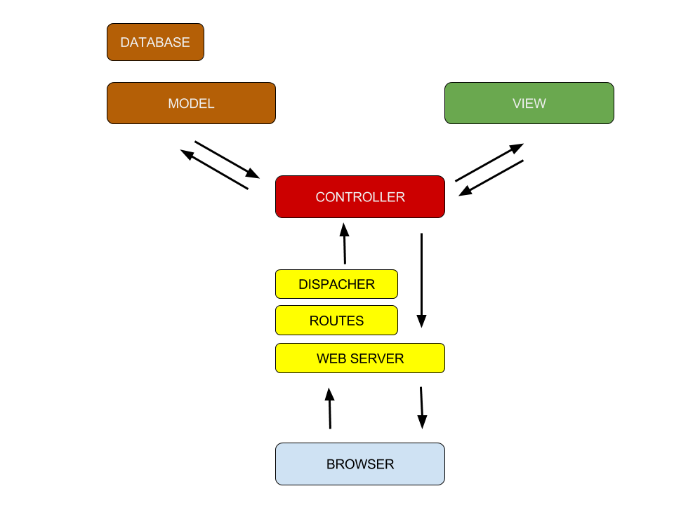

## Model View Controller

It’s more fun to imagine a story with “fat model, skinny controller” instead of a sterile “3-tiered architecture”. Models do the grunt work, views are the happy face, and controllers are the masterminds behind it all.

* The browser makes a request, such as http://mysite.com/video/show/15

* The web server (mongrel, WEBrick, etc.) receives the request. It uses routes to find out which controller to use: the default route pattern is “/controller/action/id” as defined in config/routes.rb. In our case, it’s the “video” controller, method “show”, id “15″. The web server then uses the dispatcher to create a new controller, call the action and pass the parameters.

* Controllers do the work of parsing user requests, data submissions, cookies, sessions and the “browser stuff”. They’re the pointy-haired manager that orders employees around. The best controller is Dilbert-esque: It gives orders without knowing (or caring) how it gets done. In our case, the show method in the video controller knows it needs to lookup a video. It asks the model to get video 15, and will eventually display it to the user.

* Models are Ruby classes. They talk to the database, store and validate data, perform the business logic and otherwise do the heavy lifting. They're the chubby guy in the back room crunching the numbers. In this case, the model retrieves video 15 from the database.

* Views are what the user sees: HTML, CSS, JavaScript, JSON. They're the sales rep putting up flyers and collecting surveys, at the managers direction. Views are merely puppets reading what the controller gives them. They don't know what happens in the back room. In our example, the controller gives video 15 to the “show” view. The show view generates the HTML: divs, tables, text, descriptions, footers, etc..

* The controller returns the response body (HTML, XML, etc.) & metadata (caching headers, redirects) to the server. The server combines the raw data into a proper HTTP response and sends it to the user.
* The web server is the invisible gateway, shuttling data back and forth: users never interact with the controller directly.

