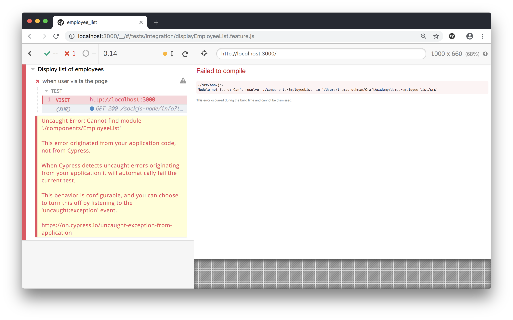

## Display employees

Okay, so our first test is passing. That's great. Let's move on.

We want to display details for 5 employees. Why 5? Well, we have to decide for something, and we want to be in control of the test data and of what we are actually showing the user. 

Let's modify our feature with the following code (inside the `it` block we added before):

```javascript
cy.get('section[name="main"]').within(() => {
  cy.get('li')
    .should('have.length', 5)
})
```

If you examine the eror message the unner is giving you, you'll see the following message

```
CypressError: Timed out retrying: Expected to find element: 'section[name="main"] li', but never found it.
```

Alright, let's do some thinking...

We want to display a collection of users. So, let's consider extracting that functionality to a separate component. We need to give the component a name. Why not call it `EmployeeList`? 

We will want this component to fetch the employee data from our back-end. Let's add that to our TODO list. Another thing to add to that TODO is that we want the component to retun a unnumbered list (`<ul></ul>`) with a list item  (`<li></li>`) for each employee...

Those list items should contain an image, first name - last name, and email... (check the lo-fi!)

Alright, the TODO list is growing - it **might** be a good idea to write it down.

Let's pretend for a moment that we have the component done and ready (we don't - but we do test the code we wish we had, right?). We can update our application code to start using it. We will add an `import` and ask our `render` method to use it: 

```javascript
import React, { Component } from 'react';
import EmployeeList from './components/EmployeeList'

class App extends Component {
  render() {
    return (
      <>
        <section name="header">
          <h1>Employee list</h1>
        </section>
        <section name="main">
          <EmployeeList />
        </section>
      </>
    );
  }
}

export default App;
```

If you check the Cypress runner, you will probably see something like this:



## The "Inside"
We will move from the "Outside" to the "Inside" and make sure we test drive the development of our new component.

RRemember the TODO list we wrote a few minutes ago? Let's put it to work and write a specification for the `<EmployeeList>` component we want to build.

We created our application using the `create-react-app` scaffolderr, so we already have `jest` installed. We will enhance it with `enzyme` - a test utility that makes it easier to test React Components' output. We will need to install `enzyme` along with an Adapter corresponding to the version of react we are using (in this case React 16.8.6). We will also add a configuration file for `enzyme`

```bash
$ yarn add --dev enzyme enzyme-adapter-react-16
$ touch src/setupTests.js
```

Add the following configuration to `setupTests.js`:

```javascript
import { configure } from 'enzyme';
import Adapter from 'enzyme-adapter-react-16';

configure({ adapter: new Adapter() }); 
```

We need to do a just a litte bit more configuration... we need to create a folder where we will hold out unit tests. By convention we will call it `__tests__` (yes, that is 2 underscores).

```bash
$ mkdir src/__tests__
```

## The EmployeeList spec

We could start with following specification as a starting point:

```javascript
import React from 'react';
import { shallow, mount } from 'enzyme';

import EmployeeList from '../components/EmployeeList'
import axios from 'axios';

describe('<EmployeeList />', () => {
  it('should fetch employees from back-end using Axios', () => {
    const axiosSpy = jest.spyOn(axios, 'get');
    shallow(
      <EmployeeList />
    )
    expect(axiosSpy).toBeCalled();
  })

  it('should render a list of 5 employees', async () => {
    const employees = {"data":[
      { "id": 1, "first_name": "George", "last_name": "Bluth", "avatar": "https://s3.amazonaws.com/uifaces/faces/twitter/calebogden/128.jpg" },
      { "id": 2, "first_name": "Janet", "last_name": "Weaver", "avatar": "https://s3.amazonaws.com/uifaces/faces/twitter/josephstein/128.jpg" },
      { "id": 3, "first_name": "Emma", "last_name": "Wong", "avatar": "https://s3.amazonaws.com/uifaces/faces/twitter/olegpogodaev/128.jpg" },
      { "id": 4, "first_name": "Eve", "last_name": "Holt", "avatar": "https://s3.amazonaws.com/uifaces/faces/twitter/marcoramires/128.jpg" },
      { "id": 5, "first_name": "Charles", "last_name": "Morris", "avatar": "https://s3.amazonaws.com/uifaces/faces/twitter/stephenmoon/128.jpg" }
    ]}

    // We mount the component
    const describedComponent = mount(<EmployeeList />)
    // we make sure that the components state is updated
    await describedComponent.setState({ employees: employees.data })
    // we make sure that the component renders 5 instances on a list item (<li>)
    expect(describedComponent.find('li')).toHaveLength(5);
  })
})

```

These specs will do to things for us:

1. make sure that we are making use of `axios` to make a `get` request when the component is being used, and

2. that once state has been updated with a list of `employees`, the component us re-rendered with the right content.

We need to start running the tests and work out way through the error messages. If we read them carefully, we WILL be pointed in the right direction.


This is an excercise in reading the test output, implementing the right code and progress one step at the time. **You can do it!** 

At the end of the tunnel, your `EmployeeList` could look something like this:

```javascript
import React, { Component } from 'react';
import axios from 'axios'

class EmployeeList extends Component {
  state = {
    employees: []
  }

  componentDidMount() {
    this.fetchEmployees()
  }

  async fetchEmployees() {
    let employees = await axios.get('https://reqres.in/api/users?per_page=5')
    this.setState({ employees: employees.data.data }) 
    // ?!? "data.data" - really?
    // Well, check out the response by setting a breakpoint just 
    // before this line withe `debugger`
  }

  render() {
    let employeeList
    employeeList = this.state.employees.map(employee => {
      return (
        <li key={employee.id}>
          {`${employee.first_name} ${employee.last_name}`}
        </li>
      )
    })
    
    return (
      <>
        <ul>
          {employeeList}
        </ul>
      </>
    );
  }
}
export default EmployeeList;
```

The interesting thing to pay attention to is what happens with your acceptance test. Once the unit test is passing, you should shift your attention to the Cypress runner and examine the status. Last time we checked, the error was quite extensive, as we tried to use the `<EmployeeList>` component even before it was created. Now that it is in place, we can hopefully look at a green state of the acceptance test. The Acceptance - Unit Test approach has come full cycle.   


