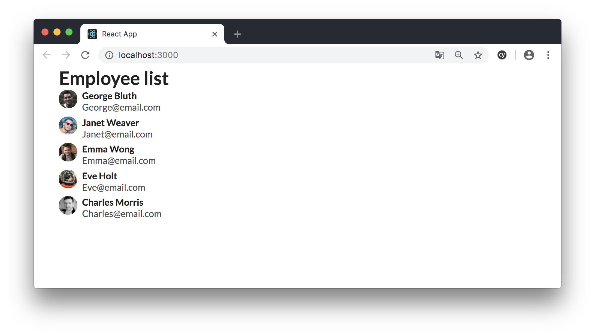

## Add styling
We will rather quickly add some styling to the list of employees and use the Semantic UI React library. (a fantastic tool in my opinion). The setup is quick and straight forward.

**Step 1** - Install the dependancies:

```bash
$ yarn add semantic-ui-react semantic-ui-css
```

**Step 2** - Once the installation has compleated, import the css to your entry point (`index.js`)

```javascript
import React from 'react';
import ReactDOM from 'react-dom';
import 'semantic-ui-css/semantic.min.css';
import App from './App';
// rest of the code...
```
**Step 3** - Done! Start using the components. For instance, let's wrap the entire page in a `Container` to get some margins. Import it to the `App` component, and update the `render()` method: 

```javascript
mport React, { Component } from 'react';
import EmployeeList from './components/EmployeeList'
import { Container } from 'semantic-ui-react'


class App extends Component {
  render() {
    return (
      <>
        <Container>
          <section name="header">
            <h1>Employee list</h1>
          </section>
          <section name="main">
            <EmployeeList />
          </section>
        </Container>
      </>
    );
  }
}

export default App;
```

Okay, so now you know. Go ahead and experiment with the design and styling.

Now, let's stop and consider a possible implication. When you work with re-designing the way you present data, you WILL end up breaking your tests. 

Consider the lo-fi we have. We are supposed to show a round avatar, full name and an email in the list of employees. That is something that Semantic UI can help us with.



We can make the following changes to the `EmployeeList` component:

```javascript
import React, { Component } from 'react';
import { List, Image } from 'semantic-ui-react'

import axios from 'axios'

class EmployeeList extends Component {
  state = {
    users: []
  }

  componentDidMount() {
    this.fetchEmployees()
  }

  async fetchEmployees() {
    let employees = await axios.get('https://reqres.in/api/users?per_page=5')
    this.setState({ employees: employees.data.data })
  }
  render() {
    let employeeList
    if (this.state.employees) {
      employeeList = this.state.employees.map(employee => {
        return (
          <React.Fragment key={employee.id}>
            <List.Item >
              <Image avatar src={employee.avatar}  />
              <List.Content>
                <List.Header as='p'>{`${employee.first_name} ${employee.last_name}`}</List.Header>
                <List.Description>
                  {`${employee.first_name}@email.com`}
                </List.Description>
              </List.Content>
            </List.Item>
          </React.Fragment>
        )
      })
    }

    return (
      <>
        <List>
          {employeeList}
        </List>
      </>
    );
  }
}

export default EmployeeList;
```

**This change will however, break out tests!** We are no longer displaying `<li>` elements, and therefore, we can not count on our assertions to evaluate true and our tests to go green. If you think about it, we are checking for those `<li>` elements in both acceptance, as well as in unit tests.

If you are not familiar with how to use developer tools in your browser and how to inspect DOM elements, this can be rather tricky to figure out.

The solution is actually quite simple. We need to change `('li')` to `('div[role="listitem"]')` - in the assertion (`expect()`) of our Cypress test as well as in the component test. Can you figure out why?  


