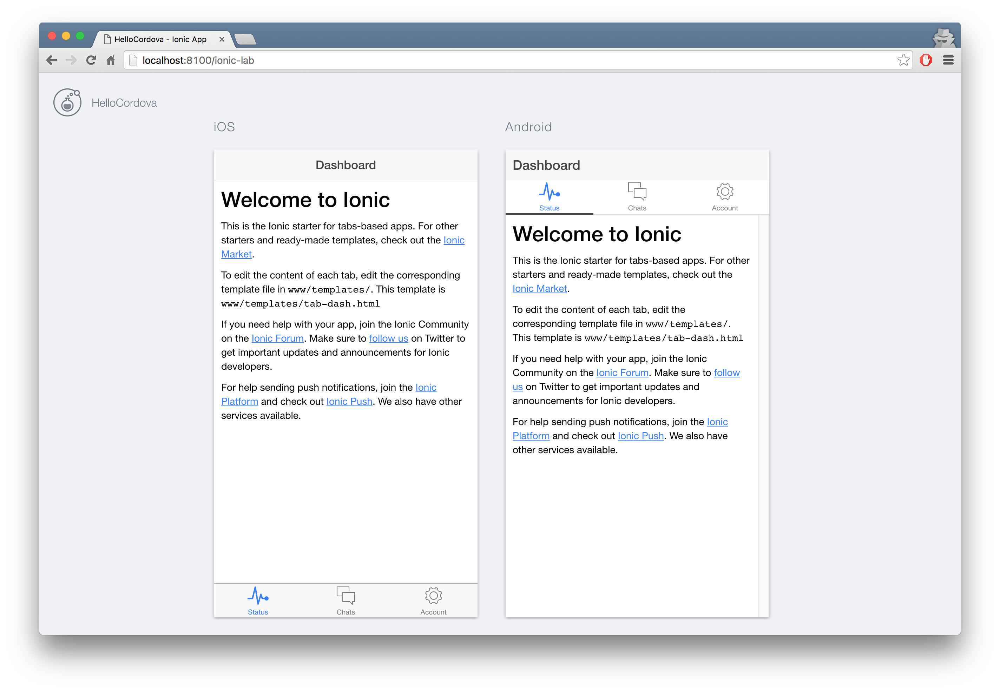

## Getting started
### Prerequisites

We will build a simple application that allows the user to enter his weight and height and calculate his personal BMI value. This  requires you to have completed the previously described [BMI Challenge](https://craftacademy.gitbooks.io/coding-as-a-craft/content/bmi_challenge/bmi_challenge.html). If you haven't completed that challenge, please go back and do it before you proceed or grab the source code to get the necessary files from the Extras chapter of this walkthrough. You will need to get your hands on `person.js` and `bmi_calculator.js`.

### Install and set up

You need to install Node.js. Make sure that Homebrew is up to date. 
```
$ brew update
$ brew doctor
```
Next, install Node (this will also install `npm`):
```
$ brew install node
```

To check your version of node run
```
$ node -v
v4.3.1 # Might be a different version on your system
```

Then, install the latest `Cordova` and `Ionic` command-line tools.

```
$ npm install -g cordova ionic
```

iOS development requires iOS simulator which you can install with 

```
$ npm -g install ios-sim
```

Better yet, you should make sure that you have [Xcode installed](https://developer.apple.com/xcode/download/) on your system. 

**Good stuff. You are ready to start your project.**

### Initiate your app

We will make use of the [Ionic Tabs](https://github.com/driftyco/ionic-starter-tabs) template. Navigate to the folder where you want to create your project and run the following command to start your application.

```
$ ionic start bmi_calculator tabs
```

Once that is complete, run the following commands to add support for iOS and Android. 

```
$ cd bmi_calculator
$ ionic platform add ios
$ ionic platform add android
```

At this point, inside the project folder, you should initialize a git repository.

```
$ git init
$ git add . 
$ git commit -am "scaffold new Ionic tabs application"
```
You should also create a new repository on GitHub and add it as a remote. *Git flow is outside the scope of this walkthrough but do make use of version control when working on this project.*

### Run the application
In your terminal run the following command to start a local server and run the application
```
$ ionic serve -c --lab
```
A browser window will open and you'll be presented with a view of both the iOS and the Android version of the application. **Pretty cool, ey?**

