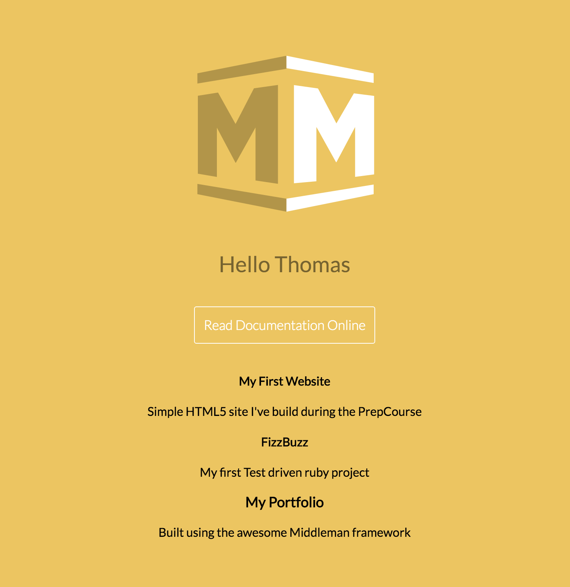

## Partials

Partials are a way of sharing content across pages and helps you to keep your code DRY. They can be used both in templates and in layouts.

Let's assume that we want to display a footer on our page.

!FILENAME spec/features/index_spec.rb
```ruby 
it 'renders footer partial' do
  expect(page).to have_selector 'footer'
  within 'footer' do
    expect(page).to have_content 'My Portfolio'
    expect(page).to have_content 'Built using the awesome Middleman framework'
  end
end
```
In order to group our partials we want to create a `partials` folder in our `source` folder. 

In that folder, let's create a file called `_footer.html.haml`. **Note the underscore at the beginning of the filename! **

!FILENAME source/partials/_footer.html.haml
```haml 
%footer
  %h3 My Portfolio
  %p Built using the awesome Middleman framework
```

Under the `= yield` command in your main layout file, place the call to render the footer partial. 

!FILENAME layouts/layout.html.haml
```haml
= partial 'partials/footer'
```
If you run your specs now, the one we just added should go green. 

**Knowing this, you can add a more complex partials to your application and keep your code DRY**




