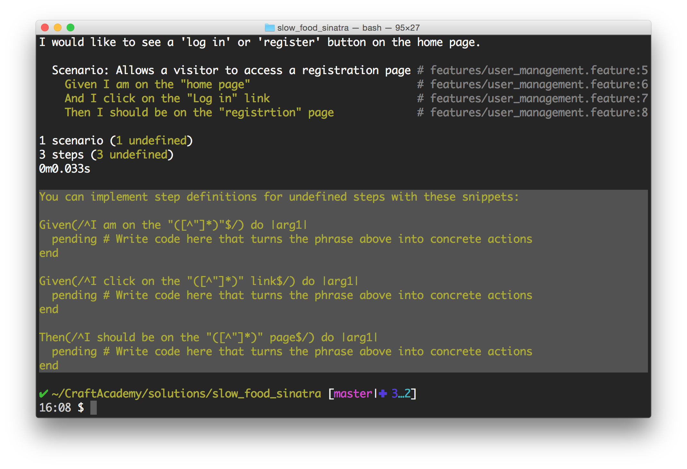

## Step 6 - Working with BDD

Working with BDD

The concept of **Behaviour Driven Development** (BDD) is pretty simple. You describe what you want the system to do by describing potential user's interactions with different parts of the application. You work outside-in to implement features using the examples to validate that you're building the right thing at the right time. 

During this week you will see BDD in action and will experience, at least partially, the benefits of this method.

The tools we will be using to test our application are **RSpec** for our unit tests and **Cucumber** for our acceptance tests. Those are the two so called **testing frameworks** that will help us to write good code. 

Cucumber (cucumber.io) is a testing framework used to describe high level functionality of your application. We will refer to them as acceptance test or features. One of Cucumber's most compelling features is that, it allows you to write these descriptions in plain text. Even in your native language.

During the development process, we'll take an approach that combines high level acceptance tests and low level unit tests to both drive the development process and make sure that we build a robust and well structured application.

###Test first - as we always do

Let's start with writing some high level acceptance tests.

What we want to do at this stage is to get the user stories we have defined together with our LoFi's and look at them from a user's perspective but also what an actual implementation of features would look like. 

In short, we want to take each user story and break it down to scenarios that each represents a use case in the application. Sounds confusing? It is, but look at it as a form of a blue print that you will use when we start to actually build the app.

*Cucumber is not installed on your system so we need to do that as a first step (see the Setup section)* 

A **feature** is one of your already defined **user stories**. It consists of one ore many  **scenarios**. A scenario is a sequence of **steps** through the feature that exercises one path.

A **scenario** is made up of 3 sections related to the 3 types of steps:

* **Given:** This sets up preconditions, or context, for the scenario.
* **When:** This is what the feature is talking about, the action, the behavior that we're focused on.
* **Then:** This checks postconditions. It verifies that the right thing happen in the When stage.
* 
There is yet another type of step you can use in a scenario path, and that is the **And** keyword. **And** can be used in any of the three sections. It serves as a nice shorthand for repeating the **Given**, **When**, or **Then**. **And** stands in for whatever the most recent explicitly named step was.

For example, let's say that we want to test our user registration feature. In the newly created features folder, please create a `user_management.feature` by returning to your terminal window and typing in:

```shell
$ touch features/user_management.feature
```
Open that file and add the following code (this is a feature description AND the first of many scenarios that constitutes acceptance criteria of this feature) 

!FILENAME features/user_management.feature
```gherkin
Feature: As a visitor
So that I can log in to the system and place orders
I would like to see a 'log in' or 'register' button on the home page.

Scenario: Allows a visitor to access a registration page
  Given I am on the "home page"
  And I click on the "Log in" link
  Then I should be on the "registrtion" page
```

Now, run cucumber in your terminal. You will get a lot of errors that you should go over carefully. 

```shell
$ cucumber
Feature: As a visitor
So that I can log in to the system and place orders
I would like to see a 'log in' or 'register' button on the home page.

  Scenario: Allows a visitor to access a registration page # features/user_management.feature:5
    Given I am on the "home page"                          # features/user_management.feature:6
    And I click on the "Log in" link                       # features/user_management.feature:7
    Then I should be on the "registrtion" page             # features/user_management.feature:8

1 scenario (1 undefined)
3 steps (3 undefined)
0m0.033s
```

And you should also see something like this on your terminal:


This is perfectly normal. What Cucumber is doing is helping you in defining so called **step definitions**, that are the actual implementation of your tests so that they can be understood by ruby. 

Confusing? Let me get you started by implementing the steps above. 

Create a new file in the `features/step_definitions` folder. 

```shell
$ touch features/step_definitions/basic_steps.rb`
```

Add the following code to that file 

!FILENAME features/step_definitions/basic_steps.rb
```ruby
You can implement step definitions for undefined steps with these snippets:

Given(/^I am on the "([^"]*)"$/) do |arg1|
  pending # Write code here that turns the phrase above into concrete actions
end

Given(/^I click on the "([^"]*)" link$/) do |arg1|
  pending # Write code here that turns the phrase above into concrete actions
end

Then(/^I should be on the "([^"]*)" page$/) do |arg1|
  pending # Write code here that turns the phrase above into concrete actions
end
```


