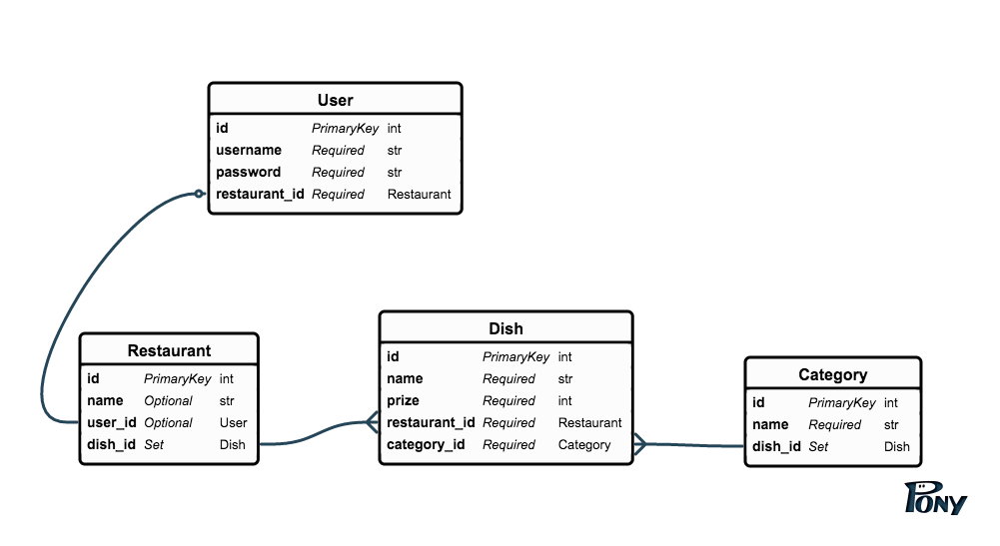

## Step 5 - Working with the database

It's time to introduce the database connection. As you've already noticed (if you have reviewed the gems in your `Gemfile`) we'll be using Postgres as a database. 

There are several differant ways to install Postgres on your computer and there is a bid risk that you will run into some issues while doing it. The simplest way is to head over to http://postgresapp.com/ and download and run the installer. 

The setup is fairly straight forward. In the documetation, we can read that the setup for Sinatra requires two gems and a single line of code. 

* Install and require the `datamapper` and `do_postgres` gems, and create a database connection:


```ruby

DataMapper.setup(:default, ENV['DATABASE_URL'] || "postgres://localhost/[YOUR_DATABASE_NAME]")
```

In order to access our database using DataMapper - an Object Relational Mapper library that will allow us to treat our data as Ruby Objects. 

Simply put, a class whose instances of we want to store in a database can be defined by adding a series of attributes to it. 

Consider this.

```ruby
class User 
  include DataMapper::Resource
  property :id,    Serial
  property :email, Text 
end 
```

Now, you'll have a set of methods you can use when creating an instance of `User`. Most important are these.

```
> my_user = User.new
> my_user.name = "Thomas"
> my_user.save
```

Or, you can do something like this. 

```
> another_user = User.create(name: "Thomas")
```

In your code, there is already a `User` class. Locate it and examine the code closely. 

In order to be able to open an interactive console that will allow you to access tis class definition and create new instances, use this command.

```shell
$ bundle exec irb -r ./lib/controller.rb
```

That will open the IRB console with all your gems and dependencies loaded. Now you can try to create a new user using the class definition in the legacy code. 

```shell
2.2.3 :001 > User.count
 => 1 
2.2.3 :002 > my_user = User.new
 => #\<User @id=nil @username=nil @password=nil> 
2.2.3 :003 > my_user.username = "Tochman"
 => "Tochman" 
2.2.3 :004 > my_user.password = "my_secret_password"
 => "my_secret_password" 
2.2.3 :005 > my_user.save
 => true 
2.2.3 :006 > my_user
 => #\<User @id=2 @username="Tochman" @password="$2a$10$Lz6uIslKglmzGiiGyjjfh.EfGA1Bp2h4PCjo7W0A2M4s/PIJSVOb6"> 
2.2.3 :007 > 
```

### ERD to Datamapper classes

In previous steps, you have created an ERD. 


Now let's create some classes using this ERD as a blueprint. 

We already have a `User` class defined. Now we need to expand it with a relation to an `Restaurant`. 

Before we move on, we need to install RSpec and initiate it (see a separate section of the course documentation on how to set up testing frameworks for this project)


Let's write some tests by following our entities design of the ERD. 

!FILENAME spec/user_spec.rb
```
require './lib/models/model'

describe User do
  it { is_expected.to have_property :id }
  it { is_expected.to have_property :username }
  it { is_expected.to have_property :password }
  
  it { is_expected.to have_one :restaurant }
end
```

And a spec for the `Restaurant` class

!FILENAME spec/restaurant_spec.rb
```
require './lib/models/restaurant'

describe Restaurand do
  it { is_expected.to have_property :id }
  it { is_expected.to have_property :name }
  
  it { is_expected.to belong_to :user }
end
```

Your job will be to make those tests to pass. Use the DataMapper documentation to find out how to set up relationships between entities/classes. 


