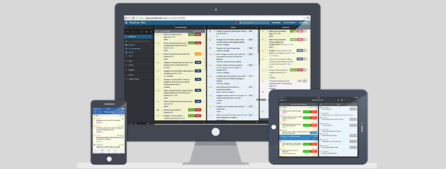
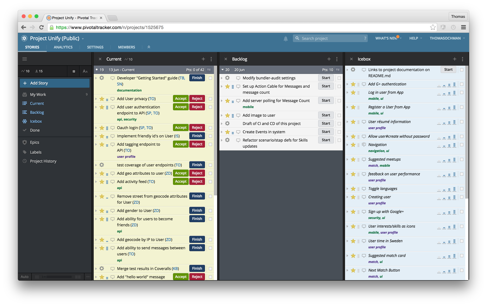
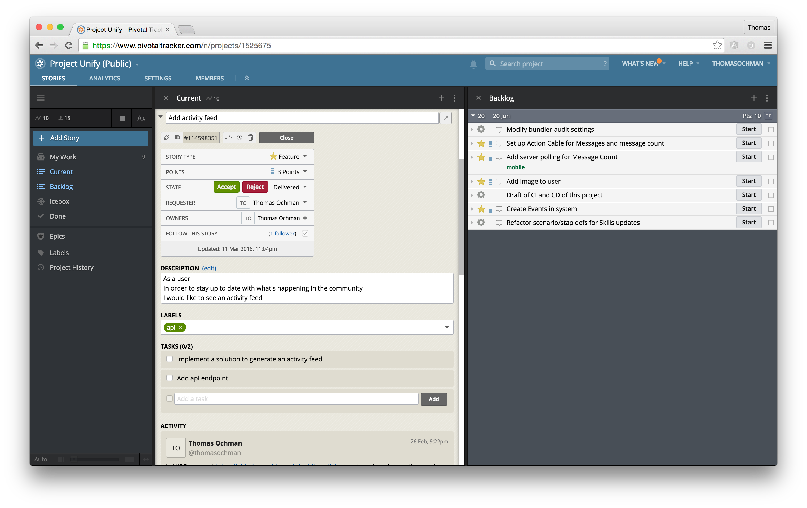

## Pivotal Tracker
**In this project, we will be using Pivotal Tracker as a tool for planning and collaboration. **

Pivotal Tracker is a straightforward project planning tool that allows teams to collaborate and react instantly to real-world changes. It’s based on agile software development methods, but it can be used on a variety of projects. Tracker frees you up to focus on getting things done, without getting bogged down, keeping your plans in sync with reality.

### Get started with PT
Visit www.pivotaltracker.com

1. Sign up for an unlimited 30-Day Free Trial (no credit card required) or click the link in a project invitation email to set your password and sign in.

2. Click **Create Project** on the Dashboard. Enter a name to create a project.
### The Basics
The core unit of projects is called a **story**. Stories will usually be one-line descriptions of features that should be implemented in the project. The description can be further expanded in the story's details.

Stories are arranged by their priority — the most important ones will be on the top of the list. They are also divided into a few panels based on their status. The **Backlog** contains all of the project's stories.

From left to right there are three panels: **Current**, **Backlog** and **Icebox**.

#### Current
The Current panel is the list of stories the team is working on this week. 

#### Backlog

The Backlog contains all the stories that the Product Owner has prioritized for the team to do next. Ideally, the stories at the top of the backlog have already been estimated as well. This is where the team looks for additional stories to work on once they've finished what's in the current pile.

Based on the velocity of the project (how quickly features are implemented and approved), the most important ones will be moved to the Current section so you have easy access to them.

#### Icebox
The Icebox is where you collect all your stories. Whether your starting a project or are adding new stories to an ongoing project this is where all stories that has not been prioritized live. In real projects, it is up to the customer to maintain the icebox and feed stories from it to the backlog. In our simulation 

### Project view
We have used Pivotal Tracker for many projects within Agile Ventures. Here is an example of a dashboard for Project Unify. It is a public project and you can visit that dashboard on https://www.pivotaltracker.com/n/projects/1525675

### Feature view
Pivotal Tracker allows you to describe each feature, chore or bug in a very detailed way and fully supports the agile methods we use in our project simulations. Here is an example of a feature with a user story, acceptance criteria, complexity points, etc. 

**Remember, the tool you use can support your workflow but it won't do the job for you. You need to add the content and work with maintaining it actively.** 

