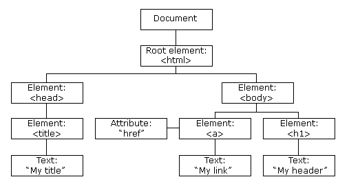

# The Document-Object Model

The HTML DOM (Document Object Model)
_*"The W3C* Document Object Model (DOM) is a platform and language-neutral interface that allows programs and scripts to dynamically access and update the content, structure, and style of a document."*_

* World Wide Web Consortium

The HTML DOM is a standard object model and programming interface for HTML. It defines:

- The HTML elements as objects
- The properties of all HTML elements
- The methods to access all HTML elements
- The events for all HTML elements
When a web page is loaded, the browser creates a Document Object Model of the page.

The HTML DOM model is constructed as a tree of Objects:





With the object model, JavaScript gets all the power it needs to create dynamic HTML:

JavaScript can:

- change all the HTML elements in the page
- change all the HTML attributes in the page
- change all the CSS styles in the page
- remove existing HTML elements and attributes
- add new HTML elements and attributes
- react to all existing HTML events in the page
- create new HTML events in the page

###Enabling JavaScript

Include javascript inside HTML:

```html
<script>
  x = 3;
</script>
```

Reference external file:
`<script src="http://example.com/script.js"></script>`

Not all browsers are JavaScript enabled. You might want to be prepared for that and redirect the user to a different page if JavaScript is disabled.

```html
<noscript>
    <meta http-equiv="refresh" content="0"; URL="http://example.com/noscript.html"/>
</noscript>
```