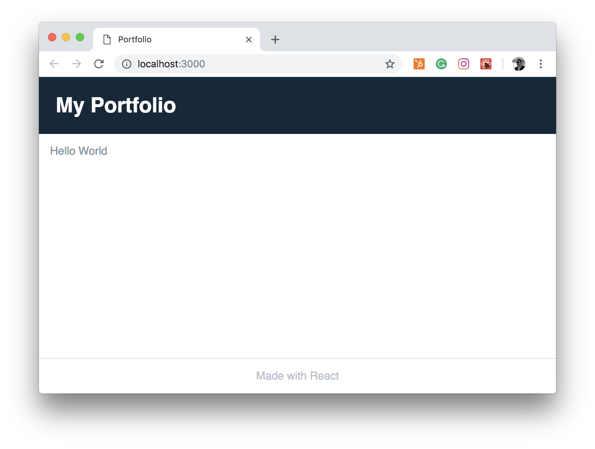

## Styling and content

Let's move on with our Portfolio AND learn about React in the mean time. Don't forget the why we are doing this - having a portfolio site is fun, and that is why we chose building one for this exercise. But the real reason we are doing all of this is to learn to build engaging user interfaces with React. 

The endgame for this section of the course is this:

We want to add a header and a footer to our application, and we want to add a little bit of styling to it. With that foundation, we will be able to move on and add some content to our portfolio site.

## Create the page structure
If you look at the screen shot above, you can see that the application has changed since left off in the previous section. We now have a header, a main content area (the "Hello World") and a footer.

We will make the changes to our code by creating 2 new components (a `Header` and a `Footer` component), reference them from our `App` component and display them in our app. Finally, we will add a CSS framework ([TailwindCSS](https://tailwindcss.com/docs/what-is-tailwind/)) and style our application a bit. 