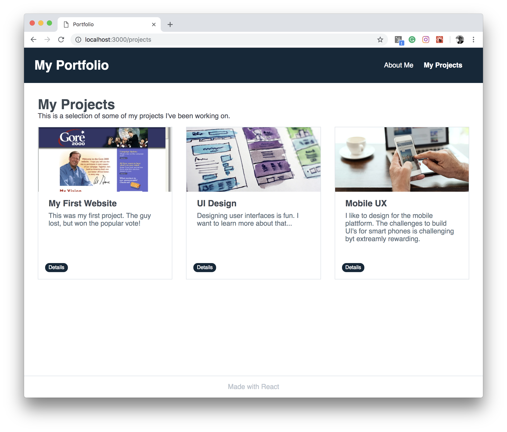

## More focus on projects - cards

We will spend some more time on our Project display and learn about `props`

This is our end game for this section of the course:



We need to add some more content to our `projects.json` and describe our projects in more detail. 

```json
[
    {
        "id": 1,
        "name": "My First Website",
        "image": "http://www.4president.us/websites/2000/2000w/gore2000home.gif",
        "description": "This was my first project. The guy lost, but won the popular vote!"
    },
    {
        "id": 2,
        "name": "UI Design",
        "image": "https://images.unsplash.com/photo-1522542550221-31fd19575a2d?ixlib=rb-1.2.1&ixid=eyJhcHBfaWQiOjEyMDd9&auto=format&fit=crop&w=1950&q=80",
        "description": "Designing user interfaces is fun. I want to learn more about that..."
    },
    {
        "id": 3,
        "name": "Mobile UX",
        "image": "https://images.unsplash.com/photo-1534237886190-ced735ca4b73?ixlib=rb-1.2.1&ixid=eyJhcHBfaWQiOjEyMDd9&auto=format&fit=crop&w=1950&q=80",
        "description": "I like to design for the mobile plattform. The challenges to build UI's for smart phones is challenging byt extreamly rewarding."
    }
]
```

If you examine the object carefully, you'll notice that we've added keys for `image` and `description`. Feel free to add your own content if you like, or use the example above. 

## Props

React components is a reusable and can be used over and over again in the UI. Quite often we want to modify what data the component we use is going to display. We can pass in data to a component using `props`.

Props (short for **properties**) are equivalent to parameters in vanilla JavaScript and used to send data to components. The main difference between `state` and `props` is that props are immutable - they can not not be changed.

We will make use of props in our projets list. 

## Re-styling the projects list. 

In the previous part, we created a `Projects` component. I suggest that we modify the `render()` function with the following code where we delegate the rendering of each project to a new component (that we will create in just a minute) called `ProjectCard`. The reason for this is that I plan to add more information and styling to each project and want to keep the `Project` component clean. And, I want to showcase how we can use `props`- this is a course after all, and we came here to learn, right?

Modify the part of the code where we populate the `projectsList` variable with HTML. Note that we will also add some Tailwind classes to the HTML we want to update our UI with. 

```javascript
if (projects.length > 0) {
      projectsList = projects.map(project => {
          return (
              <div key={project.id} className="min-h-900 my-1 px-1 w-full md:w-1/2 lg:my-4 lg:px-4 lg:w-1/3">
                  <ProjectCard project={project} />
              </div>
          )
      })
  }
```

We also need to `import` the `ProjectCard` component into `Projects`:

```javascript
import ProjectCard from "./ProjectCard"
```

Please take a close look at `<ProjectCard project={project} />`. What we are doing is sending the current `project` object to our new `ProjectCard` component. It will be accessible as `this.props.project`. 

Our new component can have a static type, so we do not have to use `class`. Create a new file in the `src` folder and call it `ProjectCard.jsx`. Add the following code to the new file:

```javascript
import React from "react"

const ProjectCard = (props) => {
    let project = props.project
    return (

        <div key={project.id} className="overflow-hidden border">
            


            <div className="px-6 py-4" style={{ minHeight: '150px' }} >
                <div className="font-bold text-xl mb-2">{project.name}</div>
                <p className="text-grey-darker text-base">
                    {project.description}
                </p>
            </div>

            <div className="flex items-center justify-between leading-none p-2 md:p-4">
                <button className="bg-blue-darkest hover:bg-blue-dark text-white text-xs py-1 px-2 rounded-full">
                    Details
                </button>
            </div>

        </div>
    )
}

export default ProjectCard

```

There are a few things to look out for.

Pay attention to the `props` parameter we are receiving. Its the `project` object we sent off from the `Projects` component. We  populate our HTML with data from that object (i.e. `project.name`, `project.description`, etc.)

Also, please note the way we define inline style for the `img` tag. In react, we need to do it slightly differently than we do in regular HTML5. `style={{ height: '150px', objectFit: 'cover' }}` is the React way to do `style="height: 150px; object-fit: cover;"`. We also set `style` on one of the divs. What attribute are we setting on that one?

## Wrap up
By adding a new component we can keep the code cleaner and more readable. It is also possible for us to reuse the component in other parts of the application. Can you think of any other use case for the `ProjectCard`? Does the naming hinder you from thinking of one? 


