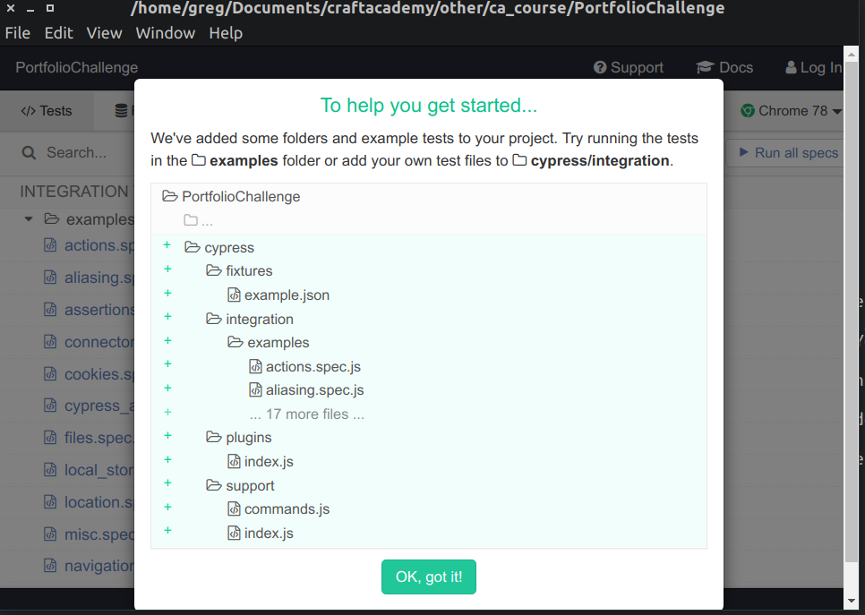

## Testing JavaScript with Cypress.io

In this section I will introduce to you a great acceptance testing framework called [Cypress.io](https://www.cypress.io/). Cypress makes testing JavaScript based applications (hence React.js) a breeze, and gives you visual feedback about your flow. It is easy to use and has great debugging tools. Let's dive in!

## Installing Cypress

You can install cypress by running:

```
npm install cypress --save-dev
```

or

```
yarn add cypress --dev
```

This will be a relatively lengthy install. After you can scaffold the cypress folder structure and launch it by running:

``` 
./node_modules/.bin/cypress open 
```

or 

```
yarn run cypress open
```

After doing that you will be greeted with the cypress window:




To make launching cypress easier add the following commands to your package json:

```json
 "scripts": {
    ...,
    "cy:run": "cypress run",
    "cy:open": "cypress open"
  },
  ```

  With that addition you can launch cypress with the `npm/yarn run cy:open` command. `cy:run` runs the tests silently, outputting the results only in your console.

  ## Folder structure

  Cypress scaffolded many folders for you let me walk through which does what:

  - fixtures/
    - This folder holds your fixture files, mock files in other words. These files can be used to mock network calls.
    - Some example json files were scaffolded you can remove those we will not use them in this project.
  - integration/
    - This folder holds your test files. You can create test files either as `example.spec.js` or as `example_spec.js` cypress will recognize both types. You can create sub-folders to group your test files.
    - By default an examples folder is scaffolded with a lot of examples by cypress. You can delete those we will not use any of them in this project
  - plugins/index.js 
    - This file can be used to load plugins. Plugins enable you to tap into, modify, or extend the internal behavior of Cypress.
  - support/commands.js
    - This file allows you to add custom commands to cypress, or overwrite existing ones.
  - support/index.js
    - It is processed and loaded automatically before your test files. This is a great place to put global configuration and behavior that modifies Cypress.

In this project we will focus on adding tests in the integration folder.

One more file has been added by the scaffold that is `cypress.json` in the root folder. Here you can configure cypress further. Let's edit this file and add the following code:

```json
{
  "baseUrl": "http://localhost:3000"
}
```

This will tell cypress that `http://localhost:3000` is the root for the project.

## Creating your first test

Cypress works very similarly to Rspec, it is organized into `describe` and `it` blocks. These are functions that receive 2 arguments, the title of the test and an anonymous function that will execute the next code block. Add the following file:

```js
// cypress/integration/visitor_can_see_landing_page.spec.js

describe('Visitor can see landing page' , () => {
  it('visitor can see landing page', () => {
    cy.visit('/')
  })
})
```

To execute cypress functions you need to use `cy` prefix. The most basic one is `visit()` which will navigate to a url which we add. Since we added the baseUlr as `http://localhost:3000` by typing in `visit('/')` we will navigate just there.

After adding that file, start your development server and run cypress and you should see something like this:


We have our first green test! Now let's see what are the most common cypress commands we can use in our tests files to find elements, interact with them and check their content.

## Most common cypress commands 


### [cy.get()](https://docs.cypress.io/api/commands/get.html#Syntax)
- Get one or more DOM elements by selector or alias.
- Examples:
  - `cy.get(.some-class)` - gets elements with `some-class` class
  - `cy.get(#some-id)` - gets elements with `some-class` id
  
### [cy.contains()](https://docs.cypress.io/api/commands/contains.html#Syntax)

- Get the DOM element containing the text. DOM elements can contain more than the desired text and still match.
- Examples:
  - `cy.contains('Hello')` - gets elements with `Hello` text
  - `cy.get('.nav').contains('About')` - gets elements with `About` text **inside** `.nav` class

### [cy.should()](https://docs.cypress.io/api/commands/should.html#Syntax)

- Create an assertion. Assertions are automatically retried until they pass or time out. An alias of [.and()](https://docs.cypress.io/api/commands/and.html#Syntax)
- Examples:
  - `cy.get('.error').should('be.empty') ` - Assert that '.error' is empty
  - `cy.contains('Login').should('be.visible')` - Assert that el is visible

### [cy.click()](https://docs.cypress.io/api/commands/click.html#Syntax)

- Click a DOM element.
- Examples:
  - `cy.get('button').click()` - Click on button


### [cy.type()](https://docs.cypress.io/api/commands/type.html#Syntax)

- Type into a DOM element.
- Examples:
  - `cy.get('input').type('Hello, World')` - Type 'Hello, World' into the 'input'

## Assertions

Modify the test file to look like this:

```js
// cypress/integration/visitor_can_see_landing_page.spec.js

/// <reference types="Cypress" />

describe("Visitor can see landing page", () => {
  it("visitor can see landing page", () => {
    cy.visit("/");
    cy.get("nav")
      .should("contain", "My Portfolio")
      .and("contain", "About Me")
      .and("contain", "My projects");
    cy.get(".main.container")
      .should("contain", "Hello World")
      .and(
        "contain",
        "I am studying to become a fullstack junior web developer"
      );
  });
});
```

By adding `/// <reference types="Cypress" />` cypress at top of the spec file your IDE will auto-complete cypress commands making it more fluent to write your specs.

In this example we are just utilizing `cy.get()` and `cy.should()` commands to check for the content on the page.

## Testing navigation

Add a second spec file:

```js
// cypress/integration/vistior_can_navigate_site.spec.js

/// <reference types="Cypress" />

describe("Visitor can navigate page", () => {
  it("visitor can navigate using the header", () => {
    cy.visit("/");
    cy.get("nav")
      .contains("My projects")
      .click();
    cy.url().should("contain", "projects");
    cy.get("nav")
      .contains("About")
      .click();
    cy.url().should("contain", "about");
    cy.get("nav")
      .contains("My Portfolio")
      .click();
    cy.url()
      .should("not.contain", "projects")
      .and("not.contain", "about");
  });
});
```

In this example we are testing navigation of the site by:
- Finding the links with `cy.get()` and `cy.contains()`
- Clicking on them with `cy.click()`
- Then checking the url with `cy.url` ([docs](https://docs.cypress.io/api/commands/url.html))


## Conclusion

In this section you learned how to set up cypress with a basic config. We wrote couple of tests to check the content of the main page and the navigation.

Your job now is to experiment with cypress further. Write specs to check the content of your project page, your about page, any additional screens or data you have added.